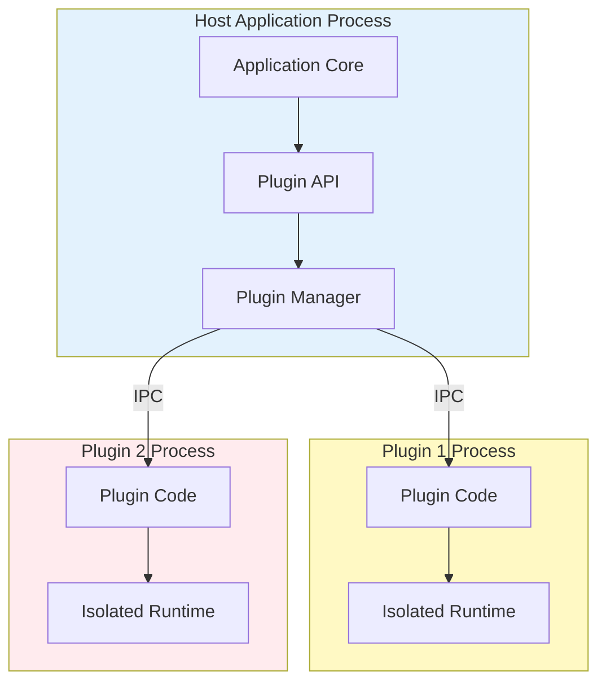

import { Card, CardContent, CardDescription, CardHeader, CardTitle } from "@/components/ui/card";
import { Badge } from "@/components/ui/badge";
import Mermaid from "@/components/astro/blog/mermaid.astro";
import Alert from "@/components/astro/blog/alert.astro";
import InfoBox from "@/components/astro/blog/info-box.astro";
import FeatureGrid from "@/components/astro/blog/feature-grid.astro";
import FeatureCard from "@/components/astro/blog/feature-card.astro";

## The Challenge of Extensibility

Modern applications increasingly require extensibility to address diverse user needs without bloating the core application. Plugin architectures enable this flexibility by allowing third-party developers to add functionality while maintaining stability and security. However, designing effective plugin systems involves balancing openness with control, performance with isolation, and simplicity with capability.

The fundamental challenge lies in exposing sufficient functionality for useful plugins while preventing malicious or buggy code from compromising the host application. Traditional approaches like dynamic library loading provide maximum flexibility but minimal isolation. Modern solutions leverage sandboxing technologies to enforce security boundaries while preserving functionality.

<InfoBox title="What Makes a Good Plugin System?">
Effective plugin architectures share several characteristics regardless of implementation technology. They provide clear security boundaries preventing plugins from accessing unauthorized resources. The plugin API remains stable across host application versions avoiding frequent plugin breakage. Discovery and loading mechanisms enable users to find and install plugins easily. The system includes comprehensive documentation and examples reducing the barrier to plugin development.
</InfoBox>

## Plugin Architecture Patterns

Several fundamental patterns emerge across successful plugin systems, each with distinct trade-offs and appropriate use cases. Understanding these patterns helps architects select approaches aligned with their security requirements, performance constraints, and developer experience goals.

### In-Process Plugins

In-process plugins load directly into the host application's memory space, sharing the same process and address space. This approach delivers maximum performance with minimal overhead for inter-component communication. Languages like C, C++, and Rust commonly use this pattern through dynamic library loading. The shared memory model enables passing complex data structures by reference rather than copying data across boundaries.

However, in-process plugins inherit significant risks. A crashing plugin brings down the entire application. Malicious plugins access any memory in the process including sensitive data. Memory corruption in one plugin can affect the host or other plugins. Resource leaks in plugins consume host application resources. These risks make in-process plugins suitable only for trusted developers and enterprise environments with strict code review processes.

### Out-of-Process Plugins

Out-of-process plugins run in separate processes communicating with the host through inter-process communication mechanisms. Operating system process boundaries provide isolation preventing one plugin from directly accessing another's memory or crashing the host application. This pattern appears in applications like web browsers where renderer processes isolate potentially malicious web content from the main browser process.

The isolation comes with performance costs. Communication requires serialization and deserialization of data crossing process boundaries. Context switching between processes adds latency to plugin operations. Complex data structures cannot be shared by reference requiring copying. Memory overhead increases as each plugin process maintains its own runtime. Despite these costs, the security benefits often justify the performance impact especially for applications executing untrusted code.

<Mermaid>

</Mermaid>

### Sandboxed Plugins

Sandboxed plugins combine aspects of both previous approaches using technologies like WebAssembly that execute in isolated environments within the same process. WASM provides a hardware-enforced security boundary without the overhead of full process isolation. Capabilities-based security models limit what plugins can access even within their sandbox.

This approach delivers strong isolation with better performance than out-of-process plugins. WASM's near-native execution speed approaches in-process plugin performance while maintaining security boundaries. The capability model enables fine-grained permission control unavailable in simpler patterns. Plugin code cannot directly access host memory or system resources without explicit grants.

## Security Boundaries and Capabilities

Effective plugin security requires multiple layers of defense working together. Relying on a single mechanism creates brittle systems vulnerable to bypass through implementation flaws or unexpected interactions. Defense in depth provides resilience even when individual layers fail.

### Memory Isolation

Memory isolation prevents plugins from reading or modifying data outside their allocated space. Process-based isolation uses operating system memory protection hardware. WebAssembly uses linear memory separate from the host's address space. Language-based approaches like Java or C# use managed runtimes with memory safety guarantees.

The level of memory isolation affects both security and performance. Hardware-enforced isolation provides the strongest guarantees but highest overhead. Software-enforced isolation offers better performance with weaker guarantees dependent on runtime correctness. The choice depends on threat model and performance requirements.

### Capability-Based Access Control

Rather than relying on identity-based access control where plugins authenticate and receive broad permissions, capability-based systems grant specific tokens enabling particular operations. A plugin wanting network access receives a capability enabling only that. The capability cannot be forged or transferred to other plugins without host mediation.

This model provides several advantages. Least privilege principles apply naturally since plugins only receive capabilities they need. Delegation works cleanly by passing capabilities between components. Revocation happens by invalidating capabilities rather than checking permissions on each operation. Capability-based designs often prove simpler and more secure than permission-based alternatives.

```rust
// Example capability-based API design
pub struct NetworkCapability {
    allowed_hosts: Vec<String>,
    allowed_ports: Vec<u16>,
}

pub struct FilesystemCapability {
    allowed_paths: Vec<PathBuf>,
    read_only: bool,
}

pub struct PluginContext {
    network: Option<NetworkCapability>,
    filesystem: Option<FilesystemCapability>,
}

// Plugin can only perform operations for which it has capabilities
impl PluginContext {
    pub fn http_get(&self, url: &str) -> Result<Response> {
        let cap = self.network
            .as_ref()
            .ok_or(Error::NoNetworkCapability)?;
        
        // Validate against capability constraints
        if !cap.is_allowed(url) {
            return Err(Error::UnauthorizedHost);
        }
        
        // Perform request...
        Ok(response)
    }
}
```

### Resource Limits

Beyond access control, resource limits prevent plugins from consuming excessive CPU, memory, storage, or network bandwidth. Without limits, a poorly written or malicious plugin can starve other components or make the host application unusable.

CPU limits use time slicing or execution quotas ensuring plugins cannot monopolize processor time. Memory limits cap the amount of heap and stack space each plugin allocates. I/O bandwidth limits prevent plugins from saturating network or disk resources. These limits require runtime support and monitoring infrastructure but prove essential for production environments.

## Communication Patterns

Plugins and hosts must communicate to exchange data and coordinate behavior. The communication pattern significantly affects both functionality and security. Different patterns suit different requirements and architectural constraints.

### Message Passing

Message passing treats plugins and hosts as independent entities exchanging messages through well-defined channels. The host sends messages requesting plugin actions, and plugins send messages reporting results or requesting services. This pattern works well for out-of-process and sandboxed plugins where shared memory is unavailable or undesirable.

Message passing naturally supports asynchronous operations. The sender continues executing after dispatching a message rather than blocking until receiving a response. This concurrency enables better resource utilization and responsiveness. However, the asynchronous nature complicates programming models requiring careful handling of message ordering and error cases.

Serialization formats significantly impact message passing performance. Binary formats like Protocol Buffers or MessagePack minimize overhead compared to text formats like JSON or XML. Schema evolution capabilities help maintain compatibility as APIs evolve. Strongly typed schemas catch errors at compile time rather than runtime.

### Remote Procedure Calls

Remote procedure calls provide a familiar programming model where function calls automatically handle cross-boundary communication. The developer writes what appears to be a local function call, but the RPC framework marshals arguments, sends them to the plugin, executes the function, and returns results.

This abstraction simplifies plugin development by hiding communication complexity. However, it can obscure performance characteristics of remote calls leading to performance problems. Network failures or slow plugins appear as unexpected delays in seemingly local operations. Careful API design and documentation help developers understand when calls cross boundaries and their performance implications.

### Shared Memory

Shared memory enables plugins and hosts to read and write the same memory region providing the highest performance communication channel. No serialization overhead exists since both parties access data structures directly. This pattern suits in-process plugins and some sandboxed environments where controlled shared memory is available.

The challenge lies in ensuring memory safety and preventing race conditions. If the host and plugin access shared data concurrently without synchronization, corruption can occur. Lock-free data structures and careful memory ordering provide safe concurrent access but require expertise to implement correctly. Higher-level abstractions like channels built on shared memory combine performance with safety.

<FeatureGrid columns={3}>
  <FeatureCard title="Message Passing">
    Clean abstraction suitable for process boundaries with good async support but serialization overhead.
  </FeatureCard>
  
  <FeatureCard title="RPC">
    Familiar programming model hiding communication complexity but obscuring performance characteristics.
  </FeatureCard>
  
  <FeatureCard title="Shared Memory">
    Maximum performance with zero-copy data access but complex synchronization requirements.
  </FeatureCard>
</FeatureGrid>

## API Design Principles

The plugin API forms the contract between host and plugins. Poor API design creates friction for plugin developers, limits functionality, or introduces security vulnerabilities. Careful design balances competing concerns creating APIs that are powerful yet secure, simple yet expressive.

### Stability and Versioning

API stability determines how often plugins break requiring updates. Stable APIs rarely change preserving compatibility across host application versions. This stability reduces maintenance burden for plugin developers but constrains the host application's evolution. Breaking changes require coordinating updates across the plugin ecosystem.

Semantic versioning helps manage this tension. Major version increments signal breaking changes requiring plugin updates. Minor versions add new functionality while maintaining backward compatibility. Patch versions fix bugs without changing behavior. Clear deprecation policies give plugin developers time to migrate before removing old APIs.

Interface-based design provides another stability mechanism. The host defines interfaces that plugins implement or consume. New functionality adds new interfaces rather than modifying existing ones. Plugins depending on old interfaces continue working while new plugins leverage enhanced capabilities.

### Error Handling

Robust error handling ensures plugin failures don't crash the host application. The host must anticipate that plugins might panic, throw exceptions, or return invalid data. Catching these errors at the boundary and handling them gracefully maintains application stability.

Error types should be specific enough to enable appropriate handling but general enough to remain stable across versions. Result types in Rust or either types in functional languages explicitly represent success and failure cases. This explicitness forces callers to handle errors rather than relying on uncaught exception handlers.

Logging and diagnostics help debug plugin issues. The plugin API should provide logging functions that plugins can call to report information. The host collects these logs enabling developers to diagnose problems. Structured logging with context about which plugin generated each message aids troubleshooting.

### Documentation and Discoverability

Comprehensive documentation lowers the barrier to plugin development. API references explain each function, its parameters, return values, and error conditions. Tutorials walk through building complete plugins from scratch. Examples demonstrate common patterns and best practices.

Documentation should live close to code, ideally in doc comments that generate reference documentation. This proximity increases the likelihood that developers update documentation when changing code. Generated documentation stays synchronized with implementation reducing the common problem of documentation drift.

Interactive documentation and experimentation environments accelerate learning. Web-based playgrounds let developers write plugin code and see results immediately without setting up development environments. This instant feedback loop helps newcomers quickly grasp API concepts and patterns.

## Plugin Discovery and Loading

Users need mechanisms to discover, install, and manage plugins. The user experience around plugins significantly affects adoption. Friction in finding or installing plugins limits the ecosystem's growth even if the underlying architecture is excellent.

### Plugin Registries

Centralized plugin registries provide searchable directories of available plugins. Users browse or search the registry finding plugins meeting their needs. The registry displays metadata like descriptions, ratings, download counts, and compatibility information. Curated collections highlight quality plugins or group plugins by use case.

Registry infrastructure requires hosting for metadata and plugin packages. Content moderation prevents malicious plugins from reaching users. Some registries implement automated security scanning detecting common vulnerabilities or malicious patterns. Manual review provides stronger security guarantees but scales poorly as the plugin ecosystem grows.

Decentralized alternatives avoid single points of control or failure. Each developer publishes plugins to their own repository or website. Aggregators index these distributed sources creating searchable directories without central hosting. This approach aligns with open source principles but complicates discovery and trust verification.

### Installation and Updates

Installation must be simple and safe. One-click installation from the registry provides the best user experience. Behind the scenes, the system downloads the plugin, verifies its signature or checksum, and installs it in the correct location. Progress indicators and error messages keep users informed about the process.

Automatic updates keep plugins current with bug fixes and security patches. The host application periodically checks for plugin updates and prompts users to install them. Silent updates that occur without user interaction provide the best security but risk breaking functionality if updates introduce bugs. Balancing security, stability, and user control requires careful policy decisions.

Plugin dependencies complicate installation. If plugin A requires plugin B, the installation system must ensure B is installed first. Version constraints add another layer of complexity when plugin A requires specific versions of B. Dependency resolution algorithms used by package managers like npm or cargo provide solutions though adapted for plugin-specific constraints.

<Alert title="Plugin Security Scanning" variant="warning">
Before installing plugins, especially from third-party sources, consider security implications. Review the plugin's requested permissions ensuring they align with its stated functionality. Check the developer's reputation and look for community reviews. Scan plugin packages with antivirus software and code analysis tools when possible. Restrict plugin capabilities using the application's security settings to limit potential damage from compromised plugins.
</Alert>

## Performance Considerations

Plugin architecture decisions significantly impact application performance. Understanding these impacts enables informed trade-offs between security, isolation, and speed. Different parts of applications have different performance sensitivities requiring tailored approaches.

### Hot Path Optimization

Operations on the hot path execute frequently and dominate overall performance. For these operations, minimize boundary crossings and serialization overhead. Consider allowing plugins to register callbacks that execute with minimal overhead. Cache results of expensive operations rather than recomputing on each call.

For truly performance-critical sections, consider bypassing the plugin API entirely. Some applications provide both a secure plugin API and an advanced native plugin interface for trusted developers. The native interface offers better performance but fewer safety guarantees. This two-tier approach balances security for general plugins with performance for specialized use cases.

### Lazy Loading

Loading all plugins at application startup increases launch time and memory consumption. Lazy loading delays plugin initialization until the user actually needs plugin functionality. This strategy improves perceived performance and reduces memory for unused plugins.

Lazy loading requires careful design to avoid unexpected delays when users first access plugin features. Background loading during idle time can pre-load likely-to-be-used plugins. Progress indicators inform users when plugin loading causes delays. These UX considerations prevent lazy loading from creating frustration despite improving overall performance.

### Caching and Memoization

Plugins often perform expensive computations that don't change frequently. Caching results avoids repeated expensive operations. The host can provide caching infrastructure that plugins use, ensuring consistent cache policies and memory management.

Cache invalidation remains challenging especially when external state affects plugin computations. The plugin API should provide mechanisms for plugins to declare cache dependencies enabling the host to invalidate caches appropriately. Time-based expiration provides a simple if imperfect solution when precise dependency tracking proves difficult.

## Testing Plugin Systems

Testing plugin architectures requires attention to both the plugin API itself and the plugins that use it. Standard unit and integration testing techniques apply, but plugin systems introduce unique challenges around isolation, versioning, and error handling.

Test fixtures should include both well-behaved plugins and intentionally misbehaving ones. Well-behaved plugins verify that the system works correctly under normal conditions. Misbehaving plugins test error handling, resource limits, and security boundaries. These adversarial tests uncover subtle bugs that only appear when plugins behave unexpectedly.

Compatibility testing across plugin versions and host versions ensures API stability promises hold in practice. Automated testing should verify that old plugins work with new host versions and that version negotiation fails gracefully when incompatibilities exist. This regression testing catches accidental breaking changes before they reach users.

Performance testing under plugin load identifies bottlenecks and scalability limits. Tests should measure overhead from security boundaries, serialization, and process management. Load testing with many concurrent plugin operations reveals threading issues and resource contention. These tests inform optimization priorities and set realistic performance expectations.

## Real-World Examples

Examining successful plugin systems reveals common patterns and practical solutions to design challenges. Visual Studio Code's extension system demonstrates effective use of out-of-process plugins with a well-designed API. Electron applications isolate renderer processes from the main process while enabling rich functionality through IPC.

Web browsers pioneered sandboxed plugin architectures though modern browsers have largely replaced plugin systems with web APIs. The isolation techniques developed for browser security including process-based sandboxing and capability systems influence desktop plugin architecture design.

The Figma plugin system uses WebAssembly for safe execution of user code while providing a rich API for manipulating designs. This approach enables a thriving plugin ecosystem without compromising application security. The declarative UI approach inspired by React enables plugins to create interfaces without direct DOM access.

## Conclusion

Designing secure plugin architectures requires careful consideration of security boundaries, communication patterns, and API design. The choice between in-process, out-of-process, and sandboxed approaches depends on threat model, performance requirements, and developer experience goals. Modern sandboxing technologies like WebAssembly provide strong isolation with acceptable performance trade-offs for many applications.

Successful plugin systems balance openness with control. They expose sufficient functionality for useful plugins while preventing malicious or buggy code from compromising the host. Clear documentation, comprehensive examples, and well-designed developer tools lower barriers to plugin creation. Thoughtful registry and installation mechanisms help users discover and manage plugins easily.

As applications increasingly require extensibility to meet diverse needs, plugin architectures become essential. Understanding the design patterns, security mechanisms, and practical considerations covered in this article helps architects build systems that enable innovation while maintaining security and performance. The future of desktop application development lies in extensible platforms that empower both developers and users to adapt software to their specific needs.
